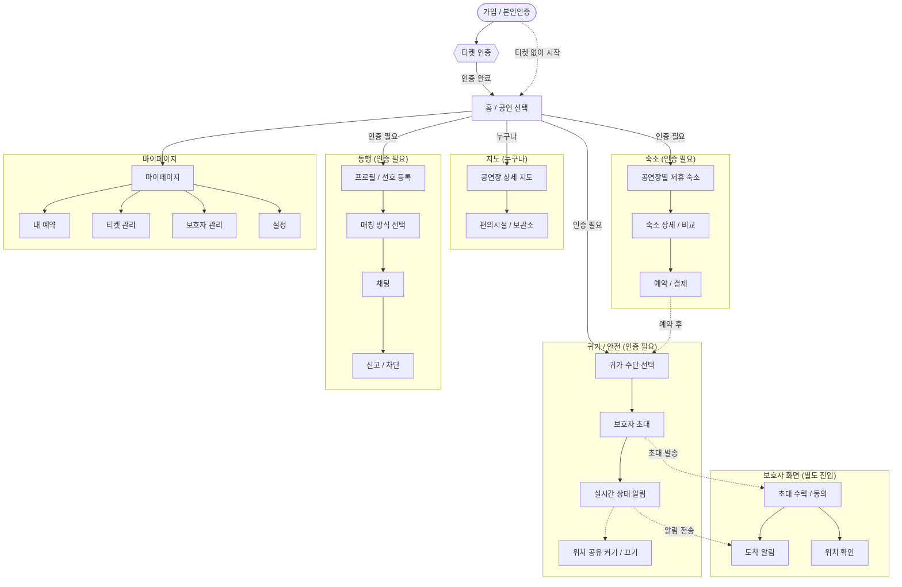

# FanStay IA (MVP)

FigJam 원본: https://www.figma.com/board/kbCOq9sX6STHXniWEyLxKn

```mermaid
flowchart TD
    signup(["가입 / 본인인증"])
    ticketAuth{{"티켓 인증"}}
    home["홈 / 공연 선택"]

    signup --> ticketAuth
    ticketAuth -->|"인증 완료"| home
    signup -.->|"티켓 없이 시작"| home

    subgraph stay ["숙소 (인증 필요)"]
        stayList["공연장별 제휴 숙소"] --> stayDetail["숙소 상세 / 비교"] --> stayPay["예약 / 결제"]
    end

    subgraph safe ["귀가 / 안전 (인증 필요)"]
        rideSelect["귀가 수단 선택"] --> guardInvite["보호자 초대"] --> status["실시간 상태 알림"]
        status -.-> locShare["위치 공유 켜기 / 끄기"]
    end

    subgraph map ["지도 (누구나)"]
        venueMap["공연장 상세 지도"] --> facilities["편의시설 / 보관소"]
    end

    subgraph mate ["동행 (인증 필요)"]
        mateProfile["프로필 / 선호 등록"] --> mateMatch["매칭 방식 선택"] --> mateChat["채팅"] --> report["신고 / 차단"]
    end

    subgraph my ["마이페이지"]
        myHub["마이페이지"] --> myBooking["내 예약"] & myTicket["티켓 관리"] & myGuard["보호자 관리"] & mySet["설정"]
    end

    subgraph guardian ["보호자 화면 (별도 진입)"]
        gAccept["초대 수락 / 동의"] --> gNoti["도착 알림"] & gLoc["위치 확인"]
    end

    home -->|"인증 필요"| stayList
    home -->|"인증 필요"| rideSelect
    home -->|"누구나"| venueMap
    home -->|"인증 필요"| mateProfile
    home --> myHub
    stayPay -.->|"예약 후"| rideSelect
    guardInvite -.->|"초대 발송"| gAccept
    status -.->|"알림 전송"| gNoti
```
